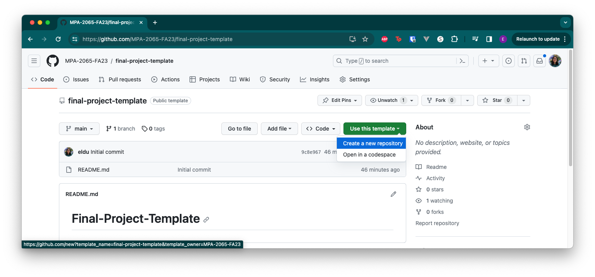
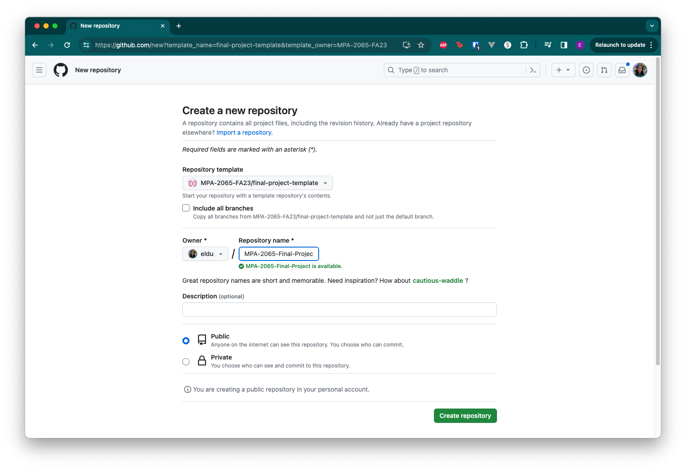
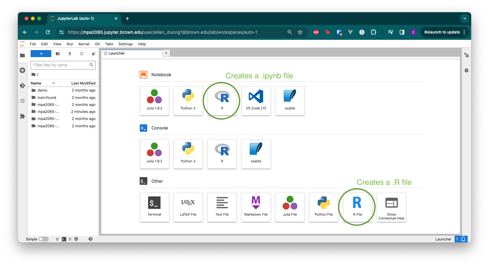

# Final Project Template

This template is a starting point for your final project if you want to work on it in JupyterHub or on your local
computer.

Feel free to edit anything and everything in this repository because this is your project.

## Instructions

### Create your repository from this template
1. Use this template. Click `Use this template` then `Create new repository`. This will create a new copy of this
repository

2. Fill out details of new repository. Add yourself as the **Owner**. Then add a name for the repository, for example 
`MPA-2065-final-project`. Keep the repository as **public** so I'll be able to see it. Otherwise, you could set it to 
**private** and add me as a collaborator. You'll be able to add your group members as collaborators to the repository 
later.

3. Add collaborators. Under your repository name on the right, click **Settings**. Then in the left sidebar, click 
**Collaborators**. Then click **Add people**. Then, 

Further instructions [Managing teams and people with access to your repository](https://docs.github.com/en/repositories/managing-your-repositorys-settings-and-features/managing-repository-settings/managing-teams-and-people-with-access-to-your-repository)

### Clone your repository
Now, you and your teammates are able to clone the repository and work on it! However, there are challenges in working
collaboratively on a coding project.

**Are you going to work on this in Jupyter Hub or on your local computer?**

**JupyterHub**

:rotating_light: :warning: Merge conflicts for `.ipynb` are difficult to clear up. I'd suggest pair-programming on the 
same account.

**Local Computer**

There are additional set up instructions if you'd like to work on your local computer. Navigate to the
[LOCAL_INSTRUCTIONS](LOCAL_INSTRUCTIONS.md) file.

## Organization of Files
`README.md`

A `README.md` file is the first file a reader encounters when browsing a repository. It's used to provide orientation, especially for first-time users.

`.gitignore`

A hidden files is a folder or file which filesystem utilities do not display by default when showing a directory listing.
A gitignore file specifies intentionally untracked files that Git should ignore. 

`images/`

Folder of images

`data/`

Folder of data